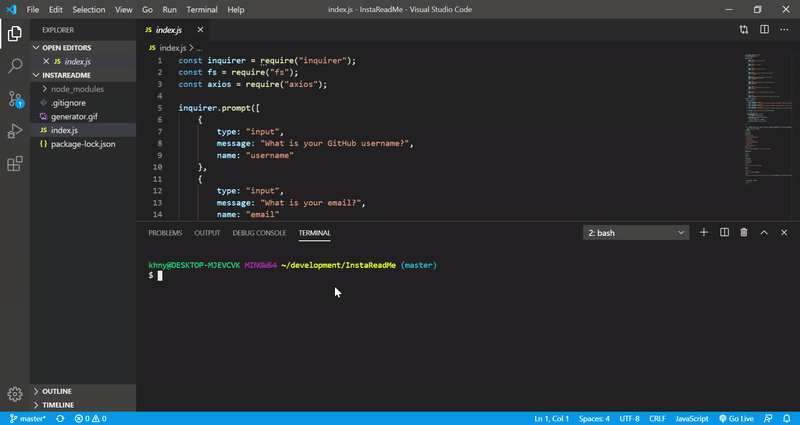

# Good README Generator



## Description

A command-line application that dynamically generates a README.md from a user's input.
        
## Table of Contents
        
* [Installation](#installation)
        
* [Usage](#usage)
        
* [License](#license)
        
* [Contributing](#contributing)
        
* [Tests](#tests)
        
* [Questions](#questions)
        
## Installation
        
To install necessary dependencies, run the following command:
        
```
npm i
```
        
## Usage

Must install dependencies!
        
## License

[](https://opensource.org/licenses/Apache-2.0)
        
## Contributing
        
You're free to add whatever you think is necessary.

## Tests
        
To run tests, run the following command:
        
```
npm test
```
        
## Questions


        
If you have any questions about the repo, open an issue or contact [khny258](https://api.github.com/users/khny258) directly at null.
        
